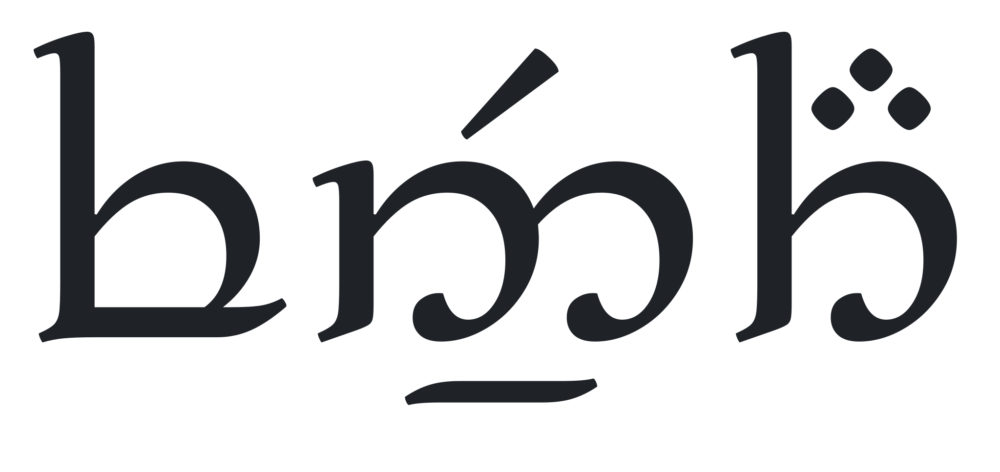

<p align="center">
  
</p>

**Add a Docker label to your container. Fennath does the rest** — provisions a
TLS certificate, creates DNS records, and starts routing HTTPS traffic to your
service. No manual certificate management, no DNS console, no proxy configuration.

## Features

- **Zero-touch HTTPS** — wildcard Let's Encrypt certs via DNS-01, automatic renewal
- **Automatic DNS** — A records created and updated when your public IP changes (Loopia API)
- **Docker label discovery** — add `fennath.subdomain=myapp` and you're live
- **TLS termination** — backends run plain HTTP, Fennath handles HTTPS
- **Full observability** — OpenTelemetry traces, metrics, and logs via OTLP
- **HTTP → HTTPS redirect** — automatic for all traffic

## Quick Start

### Prerequisites

- A domain managed by [Loopia](https://www.loopia.se/) with API credentials
- A Linux host with a public IP and ports 80/443 reachable from the internet
- Docker and Docker Compose installed

### 1. Clone and configure

```bash
git clone https://github.com/crhaglun/fennath.git
cd fennath
cp docker/.env.example docker/.env
```

Edit `docker/.env` with your domain, Loopia credentials, and certificate email.
See [`docker/.env.example`](docker/.env.example) for all available settings.

### 2. Deploy with Docker Compose

```bash
docker compose -f docker/docker-compose.yaml up -d
```

Fennath will:
1. Provision a wildcard TLS certificate from Let's Encrypt (via DNS-01 challenge)
2. Detect your public IP and create DNS A records via Loopia
3. Start proxying HTTPS traffic to your configured backends

### 3. Verify

```bash
curl -I https://grafana.yourdomain.com
```

## Configuration

All configuration is via environment variables in `docker/.env`. Copy
[`docker/.env.example`](docker/.env.example) to `docker/.env` (gitignored) and
edit for your environment.

Fennath uses the `Fennath__` prefix with `__` as section separator, following the
standard .NET configuration convention:

```bash
# Required
Fennath__Domain=example.com                          # Your registered domain
Fennath__Dns__Loopia__Username=user@loopiaapi
Fennath__Dns__Loopia__Password=your-api-password
Fennath__Certificates__Email=admin@example.com

# Optional — scope all services under a subdomain prefix
# Fennath__Subdomain=lab    # → services at *.lab.example.com
```

See `docker/.env.example` for the full list of settings including intervals,
logging levels, and OpenTelemetry configuration.

### Docker Label Discovery

Fennath discovers routes from running Docker containers via labels:

```bash
docker run -d \
  --label fennath.subdomain=myapp \
  --label fennath.port=8080 \
  my-app:latest
```

The backend URL is derived from the container name and port (`http://{container_name}:{port}`).
The `fennath.port` label defaults to 80 if omitted.

### Staging Certificates

For testing, set `Fennath__Certificates__Staging=true` in your `.env` to use
Let's Encrypt's staging environment (avoids rate limits, but certificates are
not browser-trusted).

## Development

```bash
# Build
dotnet build

# Run locally
dotnet run --project src/Fennath/

# Run tests
dotnet test
```

Requires [.NET 10 SDK](https://dotnet.microsoft.com/download/dotnet/10.0).

For local development without Docker, copy `src/Fennath/appsettings.example.json`
to `appsettings.local.json` (gitignored) and edit for your environment.

## Architecture

Fennath is built with .NET 10 and [YARP](https://github.com/microsoft/reverse-proxy)
(Yet Another Reverse Proxy). Certificates are managed via [Certes](https://github.com/fszlin/certes)
(ACME v2 client) and DNS records via Loopia's XML-RPC API.

See [`docs/adr/`](docs/adr/) for Architecture Decision Records explaining key design choices.

## Risk Analysis

Fennath is a homelab tool, not a production security appliance. Understand what
you're exposing before pointing it at the internet.

- **You are opening ports 80/443 to the internet.** Any vulnerability in Fennath,
  YARP, Kestrel, or your backend services is reachable from the public internet.
- **Wildcard TLS key compromise affects all subdomains.** A single private key
  covers `*.yourdomain.com`. If it leaks, all services are impacted.
- **No authentication at the proxy layer.** Fennath is a transparent proxy — each
  backend is responsible for its own authentication and authorization (see
  [ADR-008](docs/adr/008-no-proxy-auth.md)).
- **DNS credentials have broad access.** The Loopia API credentials can manage all
  records for your domain, not just the ones Fennath uses. They are passed as
  environment variables, which are visible via `docker inspect`, inherited by child
  processes, and readable from `/proc/<pid>/environ` inside the container.
- **Docker socket access is powerful.** Read-only access to the Docker socket still
  allows listing all containers and their environment variables.

A future improvement would be to split DNS/ACME management into a separate sidecar
container. The proxy itself doesn't need DNS credentials during normal operation —
only during certificate provisioning. A sidecar that holds the credentials and
writes certificates to a shared volume would keep DNS access and Docker socket
access in separate containers, reducing the blast radius of a compromise in either.

## License

[MIT](LICENSE)

## What does that word mean? What is that strange text at the top?

"Fennath" is a word in Sindarin, the constructed language for Tolkien's elves. It means "doorways" / "gateways" / "front doors".  
You can learn more about Sindarin and other constructed languages online, for instance [Parf Edhellen](https://www.elfdict.com)

The title is the "Fennath" written in Tengwar, the writing system devised by Tolkien for the Elvish languages.  
Font: https://github.com/Tosche/Alcarin-Tengwar/
